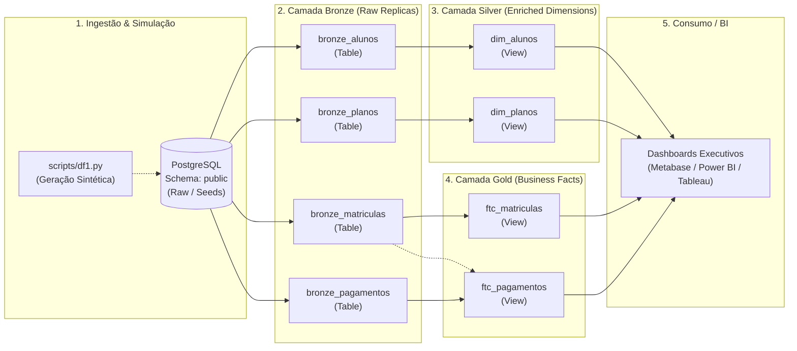

# 🏋️ FitLife Studio — Modern Data Platform & Analytics Engineering (dbt + PostgreSQL)

[](https://www.getdbt.com/)
[](https://www.postgresql.org/)
[](https://www.python.org/)
[-blueviolet?style=for-the-badge)]()
[]()

---

## 📌 Visão Geral do Projeto

O **FitLife Data Pipeline** é um projeto de **Analytics Engineering** que simula a infraestrutura de dados de uma rede de academias fictícia (**FitLife Studio**). O objetivo central do projeto é transformar dados brutos operacionais e transacionais (cadastros, planos contratados, matrículas e histórico de pagamentos) em um **Data Warehouse analítico**, utilizando boas práticas de modelagem dimensional, governança, testes de qualidade e arquitetura em camadas.

Através deste pipeline construído com **dbt (data build tool)** e **PostgreSQL**, a organização consegue monitorar seus principais indicadores estratégicos: **MRR (Monthly Recurring Revenue)**, taxa de cancelamento (**Churn Rate**), **LTV (Lifetime Value)**, perfil demográfico dos alunos e eficiência operacional de cobrança.

---

## 🎯 Desafios de Negócio e Casos de Uso

A arquitetura do pipeline foi desenhada para responder diretamente a cinco dimensões analíticas do negócio:

1. **Financeiro & Faturamento:**
   - Acompanhamento do Faturamento Mensal Recorrente (MRR) ao longo de 2 anos e identificação de sazonalidade (ex: pico de matrículas no verão).
   - Cálculo de Ticket Médio por aluno e rentabilidade por tipo de plano.
   - Distribuição de formas de pagamento (PIX, Cartão de Crédito, Boleto, Dinheiro) e controle de risco de inadimplência.

2. **Comportamento & Demografia dos Alunos:**
   - Perfil etário da base (cálculo dinâmico de idade a partir da data de nascimento).
   - Taxa de aquisição e evolução temporal de novas adesões.

3. **Performance de Vendas & Planos:**
   - Análise de penetração e aderência entre planos flexíveis (Bronze Mensal) e planos de fidelidade (Prata Trimestral, Ouro Anual e VIP Black).
   - Taxa de conversão para planos de longa duração (3 e 12 meses).

4. **Retenção, Churn & Ciclo de Vida:**
   - Monitoramento das taxas de evasão (matrículas *Canceladas* ou *Expiradas*).
   - Tempo médio de permanência (*tempo corrido* da matrícula) para projeção de LTV.
   - Identificação de planos com maior índice de cancelamento precoce.

5. **Auditoria Operacional & Adimplência:**
   - Identificação de matrículas ativas sem compensação de pagamento.
   - Intervalo médio entre a data de início da matrícula e a liquidação financeira.

---

## 🏗️ Arquitetura da Solução (Medallion Architecture)

O projeto adota o padrão de **Arquitetura Medalhão**, garantindo isolamento de responsabilidades, linhagem clara de dados (*data lineage*) e facilidade de manutenção:



### Detalhamento das Camadas

| Camada | Schema | Materialização | Descrição e Transformações |
| :--- | :--- | :--- | :--- |
| **Bronze** | `bronze` | `table` | Cópia 1:1 dos dados transacionais do schema `public`. Preserva histórico e integridade bruta dos dados sem mutações destrutivas. |
| **Silver** | `silver` | `view` / `table` | Limpeza, padronização e enriquecimento cadastral: anonimização/mascaramento de domínio de e-mails, higienização de telefones (remoção de caracteres não numéricos), identificação do dispositivo (celular vs fixo) e cálculo dinâmico da idade. |
| **Gold** | `gold` | `view` | Modelagem dimensional pronta para BI e consumo analítico: Fatos com métricas consolidadas (`tempo_corrido` das matrículas, datas normalizadas, status e valores financeiros enriquecidos com chaves das dimensões). |

---

## 📐 Modelagem de Dados

### Modelo Dimensional (Star Schema / Fact Constellation)

As duas tabelas fato (**`ftc_matriculas`** e **`ftc_pagamentos`**) são **totalmente independentes entre si** (sem relacionamentos fato-com-fato), conectando-se diretamente às **dimensões conformadas** (`dim_alunos` e `dim_planos`):

```
      ┌──────────────────────┐          ┌──────────────────────┐
      │      dim_alunos      │          │      dim_planos      │
      ├──────────────────────┤          ├──────────────────────┤
      │ PK  aluno_id         │          │ PK  plano_id         │
      │     nome             │          │     nome_plano       │
      │     email            │          │     valor_mensal     │
      │     telefone         │          │     duracao_meses    │
      │     tipo (cel/fixo)  │          │     descricao        │
      │     data_nascimento  │          └──────────┬───────────┘
      │     idade            │                     │
      └──────────┬───────────┘                     │
                 │                                 │
         ┌───────┴──────────────┐          ┌───────┴──────────────┐
         │ 1                    │ 1        │ 1                    │ 1
         │                      │          │                      │
         │ N                    │ N        │ N                    │ N
         ▼                      ▼          ▼                      ▼
┌──────────────────┐                 ┌──────────────────┐
│  ftc_matriculas  │                 │  ftc_pagamentos  │
├──────────────────┤                 ├──────────────────┤
│ PK matricula_id  │                 │ PK pagamento_id  │
│ FK aluno_id      │                 │ FK aluno_id      │
│ FK plano_id      │                 │ FK plano_id      │
│    data_inicio   │                 │    matricula_id  │ (Dimensão Degenerada)
│    data_fim      │                 │    data_pagamento│
│    tempo_corrido │                 │    forma_pagam...│
│    status        │                 │    valor_pago    │
└──────────────────┘                 └──────────────────┘
         ▲                                    ▲
         └─────────────( SEM VÍNCULO )────────┘
```

> **Nota de Arquitetura (Dimensão Degenerada):** O campo `matricula_id` é preservado em `ftc_pagamentos` unicamente como identificador transacional/auditoria (Dimensão Degenerada), sem estabelecer vínculo direto com `ftc_matriculas` na camada semântica de BI.

### Dicionário de Modelos

#### Camada Silver
- `dim_alunos`:
  - `aluno_id` (PK): Identificador exclusivo do aluno.
  - `nome`: Nome do aluno.
  - `email`: E-mail higienizado e anonimizado (`replace(email, 'email', 'fac')`).
  - `telefone`: Telefone sem pontuação ou parênteses.
  - `tipo`: Classificação do contato (`celular` quando inicia com 9 e possui 11 dígitos, caso contrário `fixo`).
  - `data_nascimento`: Data de nascimento original.
  - `idade`: Cálculo dinâmico em anos utilizando `extract(year from age(current_date, data_nascimento))`.
- `dim_planos`:
  - `plano_id` (PK): Código do plano de adesão.
  - `nome_plano`: Categoria do plano (*Bronze*, *Prata*, *Ouro*, *VIP Black*).
  - `valor_mensal`: Mensalidade contratada.
  - `duracao_meses`: Período de vigência (1, 3 ou 12 meses).
  - `descricao`: Benefícios e regras de utilização.

#### Camada Gold
- `ftc_matriculas`:
  - `matricula_id` (PK): Código da matrícula.
  - `aluno_id` (FK): Chave estrangeira para `dim_alunos`.
  - `plano_id` (FK): Chave estrangeira para `dim_planos`.
  - `data_inicio`: Início da vigência.
  - `data_fim`: Fim da vigência programada.
  - `tempo_corrido`: Intervalo transcorrido calculado via `age(data_fim, data_inicio)`.
  - `status`: Estado atual da matrícula (`Ativa`, `Cancelada`, `Expirada`).
- `ftc_pagamentos`:
  - `pagamento_id` (PK): Código único da transação.
  - `aluno_id` (FK): Chave estrangeira para `dim_alunos`.
  - `plano_id` (FK): Chave estrangeira para `dim_planos`.
  - `matricula_id`: Identificador da matrícula associada (Dimensão Degenerada).
  - `valor_pago`: Montante liquidado.
  - `data_pagamento`: Data truncada para o formato `date`.
  - `forma_pagamento`: Método utilizado (*Cartao_Credito*, *PIX*, *Boleto*, *Dinheiro*).

---

## 🧪 Qualidade de Dados & Governança

A integridade do pipeline é auditada em dois níveis:

1. **Restrições Relacionais (DDL / Database Constraints):**
   - Chaves Primárias (`PRIMARY KEY`) e Estrangeiras (`FOREIGN KEY` com `ON DELETE CASCADE`).
   - Validações de integridade lógica:
     - `chk_datas`: Garante que `data_fim > data_inicio`.
     - `CHECK (status IN ('Ativa', 'Cancelada', 'Expirada'))`.
     - `CHECK (forma_pagamento IN ('Cartao_Credito', 'PIX', 'Boleto', 'Dinheiro'))`.

2. **Testes Nativos dbt (`data_tests` / `schema.yml`):**
   - Testes de unicidade (`unique`) e não-nulidade (`not_null`) em todas as chaves primárias (`aluno_id`, `plano_id`, `matricula_id`, `pagamento_id`).

---

## 📂 Estrutura do Repositório

```text
fit-data-pipeline/
├── docs/                               # Documentação e levantamento de requisitos
│   ├── architecture.excalidraw         # Diagrama visual de arquitetura
│   ├── requisitos.md                   # Mapeamento detalhado de KPIs e regras de negócio
│   └── plaintext.txt                   # Estrutura conceitual inicial
├── scripts/                            # Scripts auxiliares para geração e carga de dados
│   ├── df1.py                          # Script Python para geração de dados sintéticos (2 anos)
│   ├── df2.py                          # Variante do gerador de dados
│   ├── create_table.sql                # DDL para criação das tabelas no PostgreSQL
│   └── insert.sql                      # DML com inserts aleatórios diretamente via SQL
├── fit_data/                           # Projeto dbt core
│   ├── dbt_project.yml                 # Arquivo central de configuração do dbt
│   ├── models/
│   │   ├── bronze/                     # Camada Raw Ingestion (1:1 com a fonte)
│   │   │   ├── bronze_alunos.sql
│   │   │   ├── bronze_matriculas.sql
│   │   │   ├── bronze_pagamentos.sql
│   │   │   └── bronze_planos.sql
│   │   ├── silver/                     # Camada de Enriquecimento e Limpeza (Dimensões)
│   │   │   ├── dim_alunos.sql
│   │   │   └── dim_planos.sql
│   │   ├── gold/                       # Camada Analítica de Consumo (Fatos)
│   │   │   ├── ftc_matriculas.sql
│   │   │   └── ftc_pagamentos.sql
│   │   └── schema.yml                  # Definição de sources, descrições e testes de qualidade
│   └── seeds/                          # Snapshots de dados estáticos para testes rápidos (.csv)
│       ├── alunos.csv
│       ├── matriculas.csv
│       ├── pagamentos.csv
│       └── planos.csv
└── requeriments.txt                    # Dependências do projeto (dbt-postgres, pandas)
```

---

## 🚀 Como Executar o Projeto Localmente

### Pré-requisitos
- **Python 3.10+**
- **PostgreSQL 14+** em execução
- Gerenciador de pacotes **pip** e **git**

### 1. Clonar o Repositório e Configurar o Ambiente Virtual
```bash
git clone https://github.com/seu-usuario/fit-data-pipeline.git
cd fit-data-pipeline

# Criar e ativar o ambiente virtual
python3 -m venv .venv
source .venv/bin/activate  # No Windows: .venv\Scripts\activate

# Instalar dependências
pip install -r requeriments.txt
```

### 2. Configurar o Banco de Dados PostgreSQL
Crie um banco de dados dedicado no PostgreSQL:
```sql
CREATE DATABASE fit_data;
```
Em seguida, execute o script de criação das tabelas e carga inicial de dados:
```bash
psql -U seu_usuario -d fit_data -f scripts/create_table.sql
psql -U seu_usuario -d fit_data -f scripts/insert.sql
```
*(Opcional: você também pode gerar novos arquivos CSV executando `python scripts/df1.py`)*

### 3. Configurar o Perfil do dbt (`profiles.yml`)
Certifique-se de que o arquivo `~/.dbt/profiles.yml` contenha a conexão correta com o seu PostgreSQL:
```yaml
fit_data:
  target: dev
  outputs:
    dev:
      type: postgres
      host: localhost
      user: seu_usuario
      password: sua_senha
      port: 5432
      dbname: fit_data
      schema: public
      threads: 4
```

### 4. Executar os Modelos e Testes do dbt
Acesse a pasta do projeto dbt:
```bash
cd fit_data

# Testar conexão
dbt debug

# Carregar dados via seeds (opcional, se desejar usar as seeds)
dbt seed

# Executar a transformação de todas as camadas (Bronze -> Silver -> Gold)
dbt run

# Executar testes de qualidade e integridade
dbt test

# Gerar e visualizar a documentação interativa com o Data Lineage (DAG)
dbt docs generate
dbt docs serve
```

---

## 📈 Próximos Passos & Melhorias Futuras

- [ ] **Orquestração de Pipelines:** Integrar com Apache Airflow ou Prefect para execuções agendadas e monitoramento de falhas.
- [ ] **Data Quality Avançado:** Adicionar testes singulares e pacotes como `dbt-expectations` para validações estatísticas (ex: valores de pagamento estritamente positivos).
- [ ] **SCD Type 2 (Snapshots):** Implementar dbt snapshots na tabela de matrículas para rastrear alterações de status ao longo do tempo.
- [ ] **Camada de Visualização (BI):** Criação de um dashboard no Metabase ou Power BI conectado diretamente às tabelas/views da camada Gold.

---

## 👨‍💻 Autor

Desenvolvido por **[Seu Nome]** como projeto de portfólio em Engenharia e Análise de Dados.

- **LinkedIn:** [linkedin.com/in/seu-perfil](https://www.linkedin.com)
- **GitHub:** [github.com/seu-usuario](https://github.com)
- **Email:** seu.email@exemplo.com

